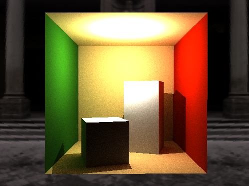

# GPU Accelerated Ray-tracer/Path-tracer

The goal of this program is to make a very fast ray tracer and expand it to a path tracer. It accomplishes this by SAH-BVH, a more optimized traversal method, and making use of the gpu for the raw speed. Then to allow for the gpu to be used we have a stackless traversal algorithm.

## More info

I have two programs due to them being each not a complete version of the all objectives I am trying to accomplish, but together accomplishing everything. We have one program for CPU which implements SAH-BVH two stackless traversal methods and path tracing, wheras we have another program which computes only on GPU as there was not enough time to make it more usable. It makes use of the faster stackless traversal method to allow for the gpu to be used without running out of memory with more complex objects. Then it also is extended to a path tracer which only completely does environment mapping. The differences come from the code needed to put all of the data structures onto the GPU. And as a result there was not enough time to make the GPU code not have small bugs in various locations given how difficult it is to debug with the GPU.

This happened because I was unable to get kernels running due to seemingly arbitrary environmental issues and so I had everything else completed for CPU before I was able to start testing any of the GPU allocated code. As a result the GPU code is an extension to the CPU code and any code added to the GPU code would basically just be copying over the CPU code and debugging it for the very specific cases that might give issues.

There is nothing new about how to run the program. For running the GPU program, cuda toolkit is necessary, a NVIDIA gpu and potentially some others that I can't name because I didn't deal with. If something is wrong it will show a black screen or the screen will open then immediatley close.

## Implementation

### Moving structures from CPU to GPU

Data is of the form:
- list< class > or class
- class is struct of primitive types (can be copied directly)

1. Allocate GPU memory
2. memcpy data to GPU space

Data is of the form:
- list< class > or class
- class contains a pointer to another class

1. Allocate GPU memory
2. Allocate CPU memory    
3. memcpy data to cpu space
4. initialize extra member variables as necessary
5. For every pointer:
    1. allocate GPU memory for appropriate pointer on CPU memory
    2. have class intialize themselves based on the CPU version of themselves in the GPU space of our CPU memory
6. copy the CPU memory into the GPU space (this will move the pointers to GPU memory as well)

Data is of the form:
- list< class > or class
- class contains a pointer allocated elsewhere

1. Allocate as previously mentioned
2. externally modify the value to refer to the new location

Data is of the form
- list< class >
- gpu version of class has more variables

1. Do same as otherwise
2. Instead of copying entire list copy each individual element and set every new variable individually

*(cudaMallocManaged() can be used so that a copy is not required and they can just be equated )*

#### Complexity:
O(n) where n is the amount of data to be moved to the GPU

#### Bugs/ Cautions:

- My configuration for GPU has some issues which would affect the demo. I am unsure and also doubt that this is something that every configuration would run into.
- I ran into cases where it would simply not load all of the textures. So I find that sometimes the textures show up and othertimes they do not. I now have code which just loads it a bunch of times until the function gives you the correct number of materials.
- There is also some stretching specific to the models that is happening as there is no stretching in the background.

### SAH-BVH

SAHcost() = C_tri + child.area/parent.area * obj_num * C_tvsl

1. pick the largest axis of the domain to be split
2. sort along that axis
3. create two lists of cost results
4. iterate through from left to right adding the new nodes and increasing the size of the bounding box in order and then computing and storing the SAH cost in the corresponding part of the array
5. do the same in the opposite direction
6. Then iterate through both cost arrays at the same time such that the left one corresponds to 1 node and the other corresponds to every node but that one, and sum their costs
7. pick the spliting of the nodes based on the lowest cost
8. end if there is only one object in volume or if the cost of splitting is higher than the previous cost

#### Complexity:
- O(n) where n is the number of nodes and assuming the sort is done in linear time

### Stackless traversal structure

#### Data structure:

node with idMiss and idHit
node would correspond by index to a BVHNode

Created by:

1. traverse the nodes beforehand
2. if a node is not a leaf:
    1. set the idHit to be the left child
    2. recurse to the left child where the parameter missed index node will be the right child
    3. recurse to the right child where you maintain the missed index node
3. if the node is a leaf:
    1. set idHit to be the missed node

This way you are assigning hit to be the left node whenever it is not a leaf and if it is then it will make the hit to be the same as a miss. Miss is just assigned to be the first node in the right tree that you have not checked.

#### Algorithm:

1. check if there is an intersection with the bbox of the current node
2. if there is an intersection and it is a leaf then compute the triangle intersection
3. even if it isn't a leaf, set the next node to be the node's hit node
4. if there is no intersection set the next node to be the node's miss node
5. end when the node is the root

#### Complexity:

- worst case: O(n) where n is the number

- not optimal since you are not checking nearer boxes first and cutting off branches if they are further

Based on: https://cs.uwaterloo.ca/~thachisu/tdf2015.pdf

### Optimized stackless traversal structure

#### Data structure:

Same as regular BVH except idParent and idSibling.

- idParent is defined as the node corresponding to the node holding the current as their left or right node. In the case of the root node the parent will be itself.
- idSibling is for any node with a parent, if the current node is the parent's left node, idSibling will be assigned to its right node and vice versa. In the case of the root node, the sibling will be itself.

#### Algorithm:

Keep track of a bit trail where a bit corresponds to the depth of which two hits occured between a left and a right node in which the second of the two's subtree has not been traverse

1. traverse the tree computing the intersections between both the left and the right node until you find a leaf node or miss both times
    1. if there is a hit shift the bit trail one to the left.
    2. traverse such that if one node is a hit and the other one is a miss, it will traverse the subtree of the hit
    3. if there is two hits, it will xor 1 to the end of the bit trail and then compare the left and right. If the left is closer it will take the left and vice versa.
2. if it is a leaf node compute the intersection between the triangles in the bounding box only setting it as a collision if it is the closest value seen
3.  traverse back up the tree until you find a new branch to descend
    1. if the bit trail is 0 it means there is nothing more to check so we return if there was a hit
    2. set the current node to its parent and right shift the bit trail by one each time until the first value is 1 corresponding to having an extra subtree that we need to check
    3. if there is a 1 at the start of the bit trail (this means we have checked it), we set it to a zero, change the current node to be its sibling and then compute the intersection.
    4. if the intersection is further than the nearest hit then repeat continuing to traverse up
    5. otherwise go back to the start and restart descending the subtree

Based on: https://diglib.eg.org/bitstream/handle/10.2312/hpg20161191/041-050.pdf
Importance sampling was adapted from: https://www.kevinbeason.com/smallpt/explicit.cpp

### Path tracing

We are implementing path tracing with next-event estimation and without recursion.

1. For every point we trace a ray and get the collision point
2. We get the luminescence to that point from every light source as we would with regular ray tracing
3. we pick a point in the hemesphere using importance sampling to make the pdf $cos(\theta)/\pi$
4. check if the sampled point intersects anything. 
5. if it intersects anything then we would return $L(\omega_o) = L + \frac{L(\omega_i)f(x)cos(\theta)}{pdf(x)}$ where f is the brdf of the current material and $L(x)$ is the Luminescence from the intersected point from the sampled ray
6. For lambertian use a pdf of 1/pi as that is a half hemesphere

To implement without recursion we just keep track of a constant term and a multiplicative term:

- $L(\omega_i) = L_i+ \frac{L(\omega_i)f(x_i)cos(\theta_i)}{pdf(x_i)}$

- $L(\omega_i) = L_i+ \frac{L_{i+1}f(x_i)cos(\theta_i)}{pdf(x_i)}+ \frac{L(\omega_{i+1})f(x_i)f(x_{i+1})cos(\theta_i)cos(\theta_{i+1})}{pdf(x_i)pdf(x_{i+1})}$

- Let $multPart_i = \frac{f(x_i)cos(\theta_i)}{pdf(x_i)}\cdot multPart_{i-1} $

- Let $constPart_i = constPart_{i-1} + L(\omega_i)\cdot multPart_{i-1}$

With this we can forgo recursion for storing these variables and updating them as we go.

#### Bugs/ cautions:

- It was not my objective to implement a proper reflection and refraction for path tracing only to make them use the stack so it could theoretically run without crashing on the gpu. So they do not work properly.

## Performance Data

Data is the average ms over a specific number of samples. Picked based on how long it took to get to that many samples.

Left is no SAH-BVH and right is with

Ray tracing
- cornellbox (collected with 20-30 samples)
    - BVH: 1615, 1120
    - StacklessBVH1: 1488, 872
    - StacklessBVH2: 1463, 855

- testObj (collected with 6-10 samples)
    - BVH: 5428, 2635
    - StacklessBVH1: 4561, 2362
    - StacklessBVH2: 3731, 1836

Path tracing (collected with 6 samples)
- cornellbox
    - BVH: 8491, 6056
    - StacklessBVH1: 7832, 4952
    - StacklessBVH2: 8147, 4930

- testObj
    - BVH: 12640,6324
    - StacklessBVH1: 11459,6413
    - StacklessBVH2: 9460,4843

GPU ray tracing (using StacklessBVH2)
- cornellbox: 13, 15
- testObj: 47, 35

*GPU is hard to test since it will spike up to 500 when you change directions and around double when moving. Neither of which can be done consistently*

## Objectives

- Parallelize ray tracing using CUDA with GPUs for no bounding volume hierarchy
- Create a directed graph which can be completely navigated by hit or miss, equivalent to the BVH tree
- implement a traversal over this DAG to implement stackless BVH traversal
- optimize traversal such that it will not consider boxes that are farther than already hit nodes
- Make it so that reflection and refraction do not use the stack
- Implement SAH-BVH.
- Implement sampling over many rays from the same pixel 
- Implement random bouncing off of lambertian surfaces for path tracing